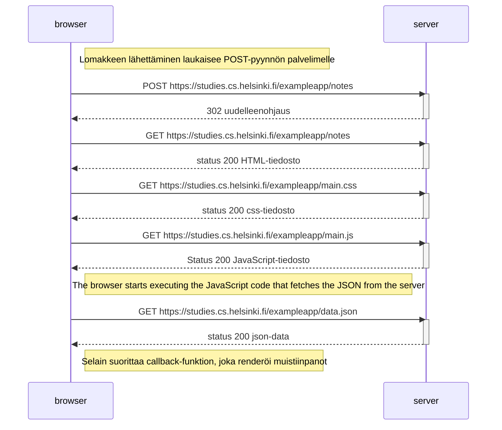

```mermaid
sequenceDiagram
    participant browser
    participant server
    Note right of browser: Lomakkeen lähettäminen laukaisee POST-pyynnön palvelimelle

    browser->>server: POST https://studies.cs.helsinki.fi/exampleapp/notes

    activate server
    server-->>browser: 302 uudelleenohjaus
    deactivate server

    browser->>server: GET https://studies.cs.helsinki.fi/exampleapp/notes
    activate server
    server-->>browser: status 200 HTML-tiedosto
    deactivate server

    browser->>server: GET https://studies.cs.helsinki.fi/exampleapp/main.css
    activate server
    server-->>browser: status 200 css-tiedosto
    deactivate server
    
    browser->>server: GET https://studies.cs.helsinki.fi/exampleapp/main.js
    activate server
    server-->>browser: Status 200 JavaScript-tiedosto
    deactivate server
    
    Note right of browser: The browser starts executing the JavaScript code that fetches the JSON from the server
    
    browser->>server: GET https://studies.cs.helsinki.fi/exampleapp/data.json
    activate server
    server-->>browser: status 200 json-data 
    deactivate server    

    Note right of browser: Selain suorittaa callback-funktion, joka renderöi muistiinpanot
```
