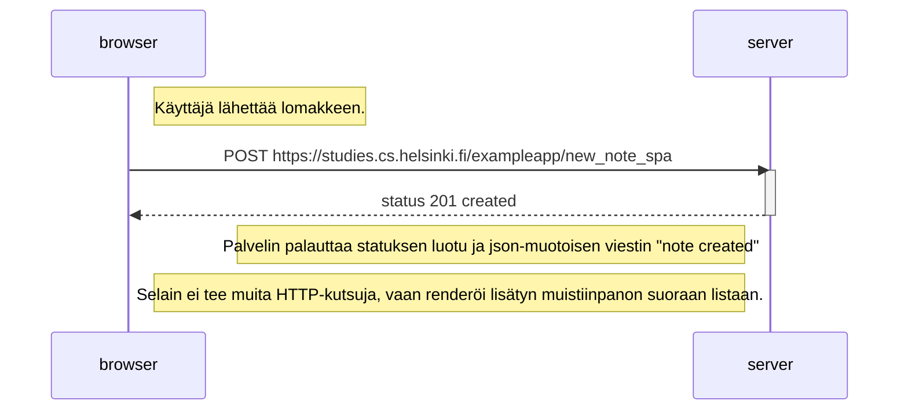

```mermaid
sequenceDiagram
    participant browser
    participant server
    Note right of browser: Käyttäjä lähettää lomakkeen.

    browser->>server: POST https://studies.cs.helsinki.fi/exampleapp/new_note_spa
    activate server
    server-->>browser: status 201 created
    deactivate server

    Note left of server: Palvelin palauttaa statuksen luotu ja json-muotoisen viestin "note created"
    
    Note right of browser: Selain ei tee muita HTTP-kutsuja, vaan renderöi lisätyn muistiinpanon suoraan listaan.
```
